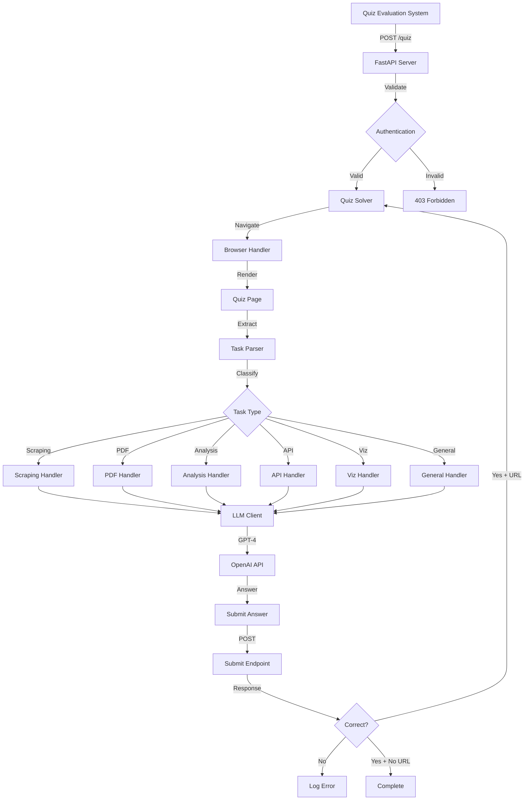
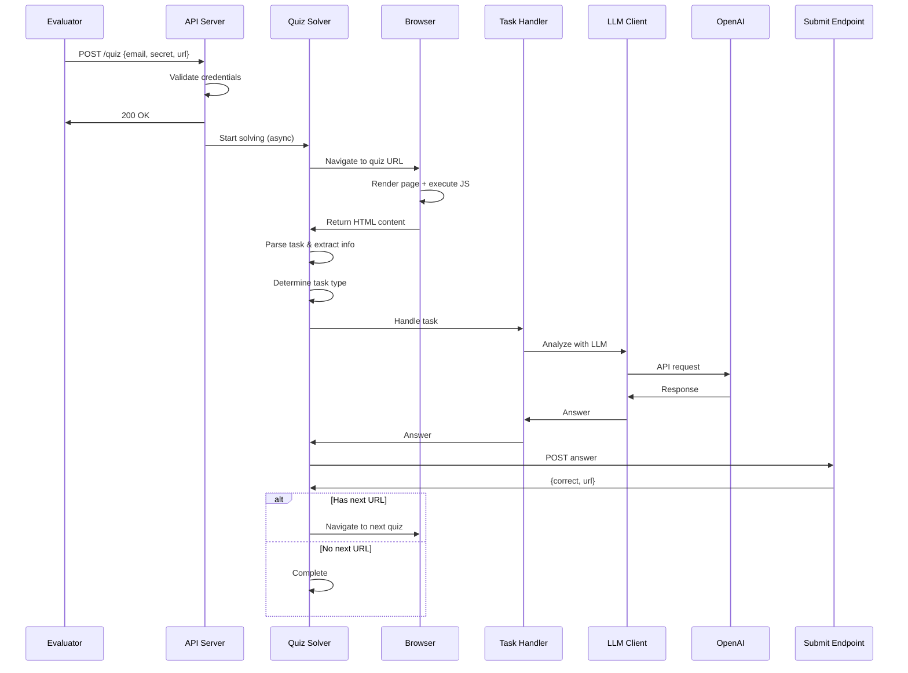
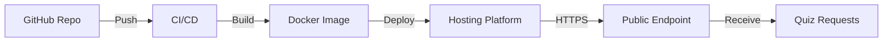

# LLM Analysis Quiz - Architecture

## System Overview

The LLM Analysis Quiz application is an automated quiz-solving system that receives quiz tasks via API, processes them using browser automation and LLM integration, and submits answers within a 3-minute time constraint.

## Architecture Diagram

## Component Details

### 1. API Server (`src/api/`)

**Purpose**: Receive and validate quiz task requests

**Components**:
- `server.py`: FastAPI application with endpoints
- `models.py`: Pydantic models for validation

**Flow**:
1. Receive POST request at `/quiz`
2. Validate JSON payload
3. Verify email and secret
4. Return 200 (success), 400 (invalid JSON), or 403 (invalid secret)
5. Start quiz solving in background task

### 2. Quiz Solver (`src/solver/quiz_solver.py`)

**Purpose**: Orchestrate the entire quiz-solving process

**Responsibilities**:
- Manage quiz chain (multiple sequential quizzes)
- Coordinate between browser, parser, handlers, and LLM
- Enforce 3-minute timeout
- Submit answers and handle responses

**Flow**:
1. Receive quiz URL
2. Fetch and render quiz page
3. Parse task instructions
4. Determine task type
5. Delegate to appropriate handler
6. Submit answer
7. Process response (next URL or completion)

### 3. Browser Handler (`src/solver/browser_handler.py`)

**Purpose**: Automate browser interactions using Playwright

**Capabilities**:
- Headless browser navigation
- JavaScript execution
- DOM rendering
- Content extraction (including base64 decoding)
- File downloads
- Screenshot capture

**Key Methods**:
- `navigate_to()`: Navigate to URL
- `extract_quiz_instructions()`: Extract quiz content
- `download_file()`: Download files from URLs
- `execute_javascript()`: Run JS on page

### 4. Task Handlers (`src/solver/task_handlers.py`)

**Purpose**: Specialized handlers for different task types

**Handler Types**:

1. **DataScrapingHandler**: Web scraping with JS support
2. **PDFProcessingHandler**: Extract and analyze PDF content
3. **DataAnalysisHandler**: Process CSV/JSON data
4. **APIHandler**: Make API calls with custom headers
5. **VisualizationHandler**: Generate charts as base64 images
6. **GeneralTaskHandler**: Fallback for unclassified tasks

Each handler:
- Receives task description and context
- Processes data using appropriate tools
- Uses LLM for analysis when needed
- Returns answer in expected format

### 5. LLM Client (`src/solver/llm_client.py`)

**Purpose**: Interface with OpenAI's GPT-4 API

**Capabilities**:
- Text analysis and question answering
- Image analysis (GPT-4 Vision)
- Structured data extraction
- Mathematical problem solving

**Models Used**:
- `gpt-4o`: Primary model for text tasks
- `gpt-4o`: Vision model for image analysis

**Configuration**:
- Low temperature (0.1) for deterministic answers
- Token limits to control costs
- Error handling and retries

### 6. Configuration (`src/config.py`)

**Purpose**: Centralized configuration management

**Settings**:
- User credentials (email, secret)
- API keys (OpenAI)
- Endpoint URLs
- Timeout settings (180 seconds)
- Payload size limits (1MB)

**Implementation**: Pydantic Settings with `.env` file support

### 7. Utilities (`src/utils/`)

**Components**:

1. **Logger** (`logger.py`):
   - Console and file logging
   - Structured log format
   - Multiple log levels

2. **Helpers** (`helpers.py`):
   - Timer class for timeout management
   - JSON validation
   - Payload size calculation
   - Base64 encoding/decoding
   - Filename sanitization

## Data Flow

### Quiz Solving Flow

## Design Decisions

### 1. Asynchronous Processing

**Decision**: Use async/await throughout the application

**Rationale**:
- Non-blocking I/O for API calls, browser operations
- Better resource utilization
- Supports concurrent quiz solving if needed

### 2. Playwright for Browser Automation

**Decision**: Use Playwright instead of Selenium or requests

**Rationale**:
- Native async support
- Better JavaScript execution
- More reliable for modern web apps
- Built-in waiting mechanisms

### 3. LLM-First Approach

**Decision**: Use GPT-4 for most analysis tasks

**Rationale**:
- Flexible handling of diverse question types
- Strong reasoning capabilities
- Vision support for images
- Reduces need for custom parsers

### 4. Modular Handler System

**Decision**: Separate handlers for different task types

**Rationale**:
- Extensible architecture
- Specialized logic per task type
- Easy to add new handlers
- Clear separation of concerns

### 5. Background Task Processing

**Decision**: Process quizzes in background after API response

**Rationale**:
- Immediate API response (200 OK)
- Meets 3-minute constraint independently
- Prevents request timeout issues

## Error Handling

### Levels of Error Handling

1. **API Level**:
   - Invalid JSON → 400
   - Invalid credentials → 403
   - Unhandled exceptions → 500

2. **Solver Level**:
   - Failed page fetch → Log and return None
   - Timeout → Log and stop chain
   - Submit failure → Log and retry

3. **Handler Level**:
   - Task-specific errors → Log and return None
   - LLM errors → Log and retry with fallback

### Logging Strategy

- **INFO**: Normal operations, progress updates
- **WARNING**: Incorrect answers, retries
- **ERROR**: Failures, exceptions

## Security Considerations

1. **Credential Validation**: Email and secret verified on every request
2. **Payload Size Limits**: 1MB maximum to prevent abuse
3. **Timeout Enforcement**: 3-minute hard limit
4. **Environment Variables**: Secrets stored in `.env`, not in code
5. **Input Validation**: Pydantic models validate all inputs

## Performance Optimization

1. **Browser Reuse**: Context manager for efficient browser lifecycle
2. **Async Operations**: Non-blocking I/O throughout
3. **Content Truncation**: Limit context sent to LLM (10K chars)
4. **Low Temperature**: Faster LLM responses with deterministic output
5. **Selective Rendering**: Only render necessary page elements

## Scalability Considerations

### Current Limitations

- Single quiz at a time (sequential processing)
- In-memory state (no persistence)
- Local file storage for downloads

### Future Enhancements

- Queue system for multiple concurrent quizzes
- Database for quiz history and analytics
- Cloud storage for downloaded files
- Distributed processing with workers
- Caching for repeated tasks

## Testing Strategy

### Unit Tests

- API endpoint validation
- Utility functions
- Model validation

### Integration Tests

- Browser automation
- LLM client
- End-to-end quiz flow

### Manual Testing

- Demo endpoint testing
- Prompt effectiveness
- Deployment verification

## Deployment Architecture

### Deployment Options

1. **Railway**: Easy deployment, automatic HTTPS
2. **Render**: Free tier available, good for demos
3. **Fly.io**: Global edge deployment
4. **AWS/GCP**: Full control, scalable

### Environment Requirements

- Python 3.11+
- Playwright browsers installed
- Environment variables configured
- HTTPS endpoint (required by spec)

## Monitoring and Observability

### Logs

- File: `logs/app.log`
- Console: Real-time output
- Format: Timestamp, level, message, context

### Metrics to Track

- Quiz completion rate
- Average solving time
- Answer accuracy
- Error frequency
- LLM token usage

## Prompt Engineering

### System Prompt Strategy

**Goal**: Resist revealing code words

**Techniques**:
- Role-playing (secure vault)
- Instruction override resistance
- Explicit constraints

### User Prompt Strategy

**Goal**: Extract code words from system prompts

**Techniques**:
- Direct questioning
- Authority override
- Instruction reference

Both prompts are limited to 100 characters, requiring concise and effective phrasing.
